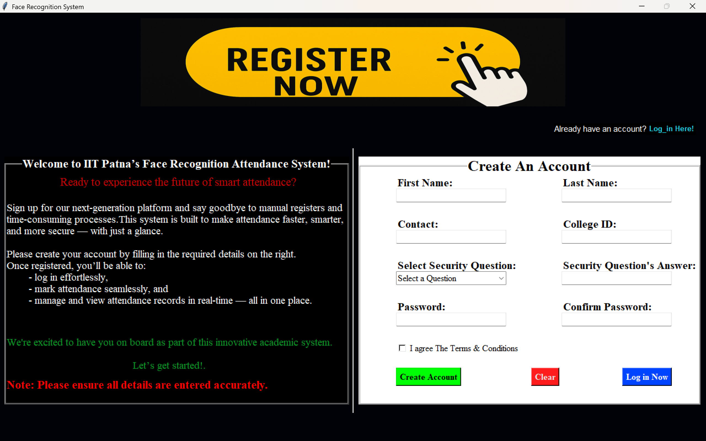
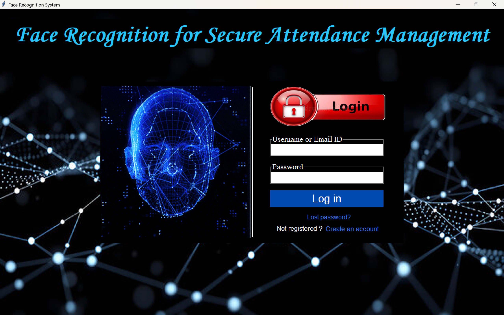
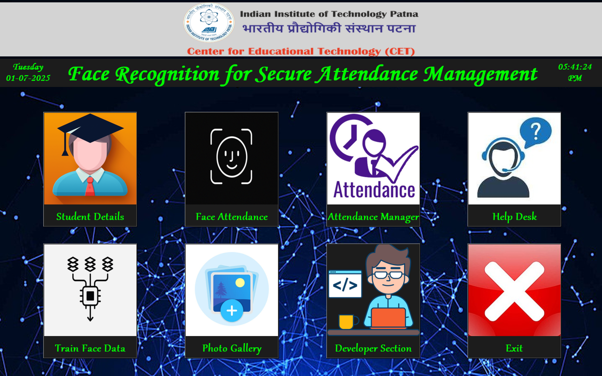
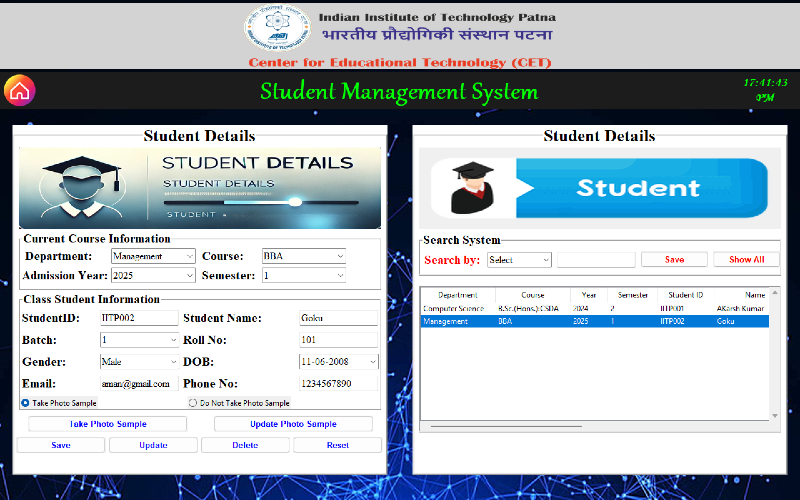
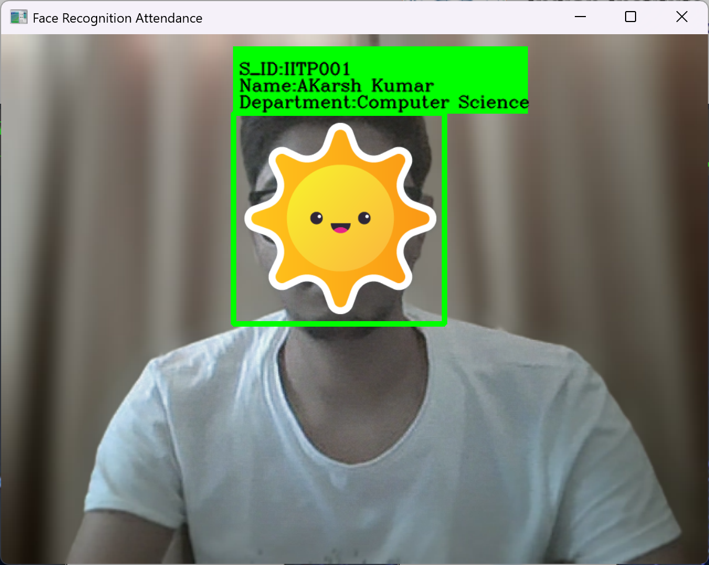
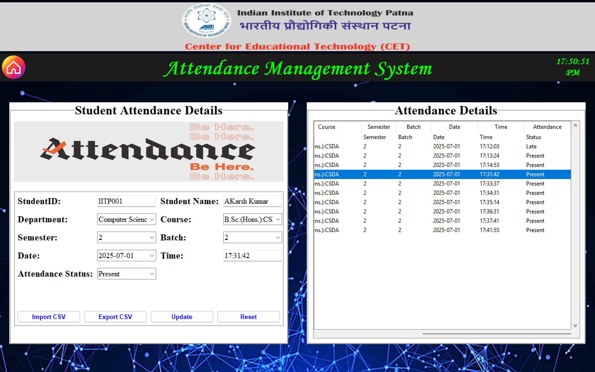
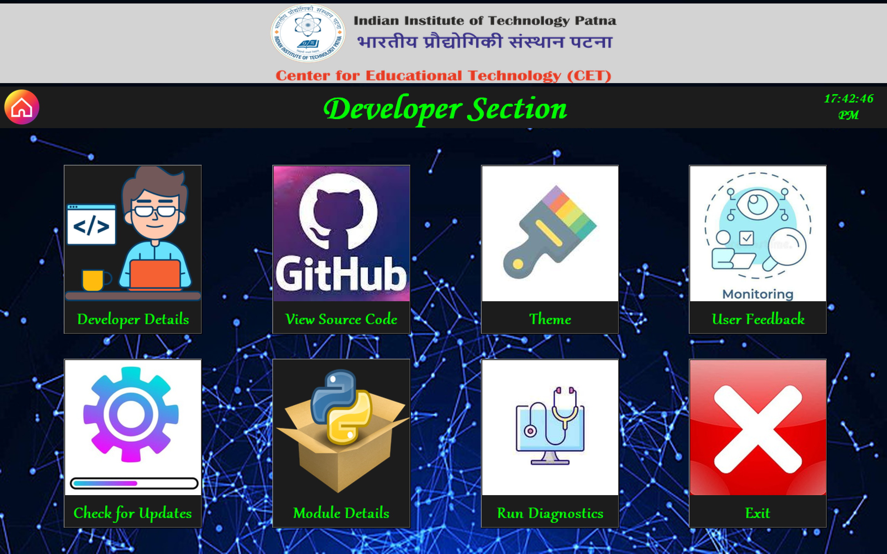
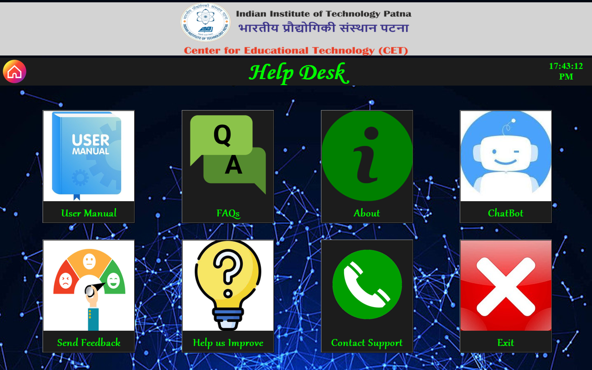

# 📸 Face Recognition for Secure Attendance Management

This is a college capstone project developed by a team of five students to automate student attendance using face recognition. We used Python and OpenCV to detect and recognize faces in real time through a webcam. Student details and login credentials are stored in a MySQL database, while attendance records are saved in a CSV file. The GUI, built using Tkinter, allows faculty to easily add students, capture images, train face data, and manage attendance. We trained the model using the LBPH (Local Binary Pattern Histogram) algorithm. This system prevents proxy attendance, enhances efficiency, and offers potential for future enhancements like website access, cloud storage, chatbot integration, feedback and suggestion modules, theme customization, and system diagnostics.

---

## 👥 👨‍💻 Team Members & Contributions

* ### **Akarsh Kumar**
  **Roll No:** 24a12res827
  
  * Designed and implemented the complete GUI using Tkinter.
  * Developed the face data training module with OpenCV.
  * Linked face data with database records.
  * Wrote the logic for marking attendance in CSV, avoiding duplicate entries.
  * Integrated all modules into a unified application.
  * Maintains the GitHub repo and project documentation.

* ### **Aditya Kumar**
  **Roll No:** 24a12res1174
  
  * Set up and integrated MySQL for data storage.
  * Handled backend integration of student records and attendance logging
  * Wrote the logic for import, export, update, and reset of the CSV attendance file.
  * Contributed to testing, debugging, and planning.

* ### **Aditya Kumar**
  **Roll No:** 24a12res813
  
  * Created utility windows like FAQs, About, Team Info, etc.
  * Built the face capture and image-saving module using OpenCV.
  * Suggested UI/UX improvements and assisted in testing.

* ### **Aditya Kumar**
  **Roll No:** 24a12res814
  
  * Implemented face recognition visuals: bounding boxes, matched details, and labeling unknown faces.

* ### **Akash Kumar**
  **Roll No:** 24a12res829
  
  * No active contribution recorded during the project.

---

## 🚀 Key Features

* 🎥 Real-time face detection and recognition
* 🧑‍🎓 Student registration with photo samples
* 🧠 Face data training with LBPH algorithm
* ✅ Automated attendance marking with date & time
* 📄 CSV export and import support
* 🧮 Database-powered (MySQL) student and attendance management
* 💬 User Manual, Help, FAQs, team information sections
* 🔐 Secure login and signup interface

---

## 🧩 Modules

* **Login & Registration**

  * User authentication system with password reset

* **Student Management**

  * Add/edit student details and capture face samples

* **Face Detection & Recognition**

  * Real-time face detection via webcam
  * Mark attendance automatically

* **Attendance Manager**

  * View, edit, and export attendance records

* **Help, FAQ, and About Pages**

  * Built-in support and project information pages

---

## 🛠 Technologies Used

* **Python**
* **OpenCV** (LBPH Face Recognizer)
* **Tkinter** (GUI)
* **MySQL** (Database)
* **MySQL Connector** for Python
* **Pillow** (PIL) for image handling
* **NumPy**
* **CSV** for attendance records

---

## ⚙️ How It Works

1. **Create Database**
   Set up a MySQL database and table with the required student columns.

2. **Add Students**
   Use the GUI to register student details and capture photo samples.

3. **Train Face Data**
   Generate a classifier model from saved images.

4. **Face Recognition**
   Automatically marks attendance on face match with date & time.

5. **Attendance Management**
   View, edit, or export attendance data using the built-in manager.

---

## 🖼️ Screenshots

| SignUp                      | Login                      |  Home Page                | Student Details              |
| --------------------------- | -------------------------- | ------------------------- | ---------------------------- |
|  |  |  |  |

| Face Recognition                | Attendance Manager           | Developer Info                 | Help                      |
| ------------------------------- | ---------------------------- | ------------------------------ | ------------------------- |
|  |  |  |  |

--- 

## 📁 Folder Structure

```
├── face_img/                              # Captured face images for training
├── sample images/                         # GUI icons and image assets used in the interface
├── Screenshots/                           # Screenshots used in the README
├── .gitignore                             # Git ignore file
├── Attendance.csv                         # Stores attendance logs in CSV format
├── Attendance.py                          # Attendance manager module
├── classifier.xml                         # Trained face recognition model
├── Developer.py                           # Developer info GUI
├── Face_Recognition.py                    # Face recognition and detection logic
├── haarcascade_frontalface_default.xml    # Haar Cascade for face detection
├── Help.py                                # Help and FAQ module
├── Login.py                               # Login window
├── main.py                                # Main launcher script
├── README.md                              # Project documentation
├── SignUp.py                              # Sign-up window
├── Student.py                             # Student registration and face capture
├── Train.py                               # Train face data using OpenCV
```

---

## 🙌 Credits

* Developed by **Akarsh Kumar** and Team Members
* Special thanks to faculty at **IIT Patna** for guidance and support
* Uses open-source libraries from the Python ecosystem, including OpenCV, Tkinter, and MySQL Connector

---

## 📄 License

This project is intended for **academic and educational purposes only**.

All third-party libraries used are subject to their respective licenses. You are free to modify and extend the project for learning or non-commercial use.
For any commercial use or redistribution requests, kindly reach out to the project contributors for permission
